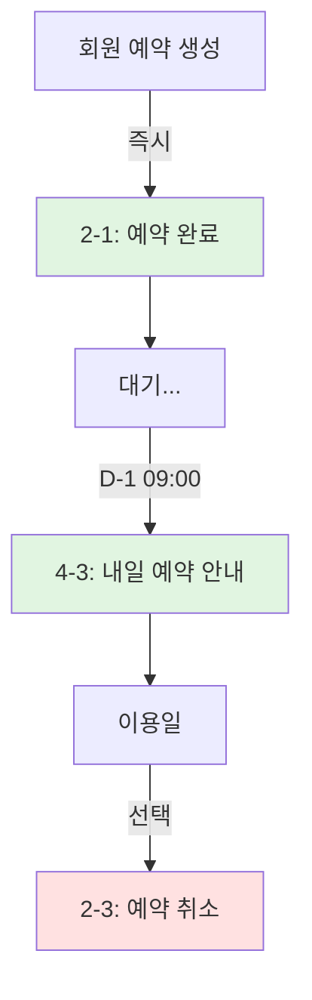
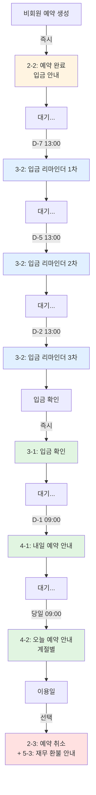
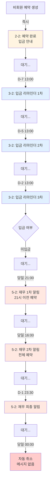
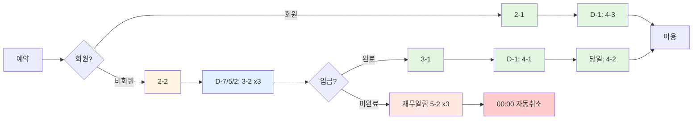

# 온음 문자 메시지 발송 플로우 차트

## 회원 예약 플로우

---

## 비회원 예약 플로우 - 정상 (입금 완료)

---

## 비회원 예약 플로우 - 미입금 취소

---

## 크론 자동 발송 타임라인

```mermaid
gantt
    title 온음 크론 스케줄 (매일)
    dateFormat HH:mm
    axisFormat %H:%M
    
    section 예약자
    전날 리마인더 (4-1/4-3)     :milestone, m1, 09:00, 0m
    당일 리마인더 (4-2)         :milestone, m2, 09:00, 0m
    
    section 미입금
    입금 리마인더 D-7/5/2 (3-2) :milestone, m3, 13:00, 0m
    
    section 재무
    미입금 2차 알림 (5-2)       :milestone, m4, 16:00, 0m
    미입금 1차 알림 (5-2)       :milestone, m5, 21:00, 0m
    미입금 최종 알림 (5-2)      :milestone, m6, 23:30, 0m
    
    section 시스템
    미입금 자동 취소            :crit, milestone, m7, 00:00, 0m
```

---

## 메시지 타입별 색상 범례

| 색상 | 의미 | 메시지 타입 |
|------|------|-------------|
| 🟢 초록 | 예약 완료/확정 | 2-1, 3-1, 4-1, 4-3 |
| 🟡 노랑 | 입금 안내 | 2-2 |
| 🔵 파랑 | 입금 리마인더 | 3-2 |
| 🟠 주황 | 재무 알림 | 5-2 |
| 🔴 빨강 | 취소/환불 | 2-3, 5-3 |
| ⚫ 회색 | 자동 처리 | 자동 취소 |

---

## 간단 요약 플로우

---

**작성일:** 2026-03-19  
**작성자:** 버즈  
**버전:** 1.0
