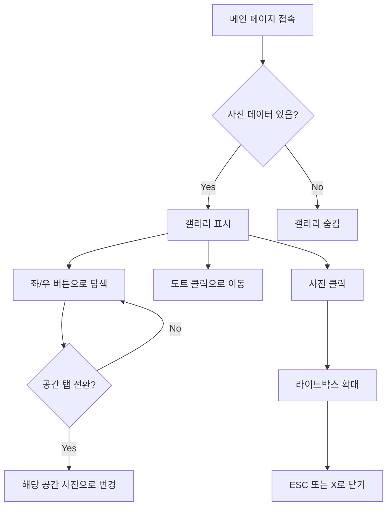
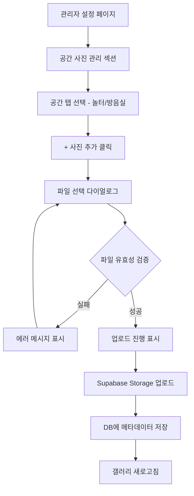
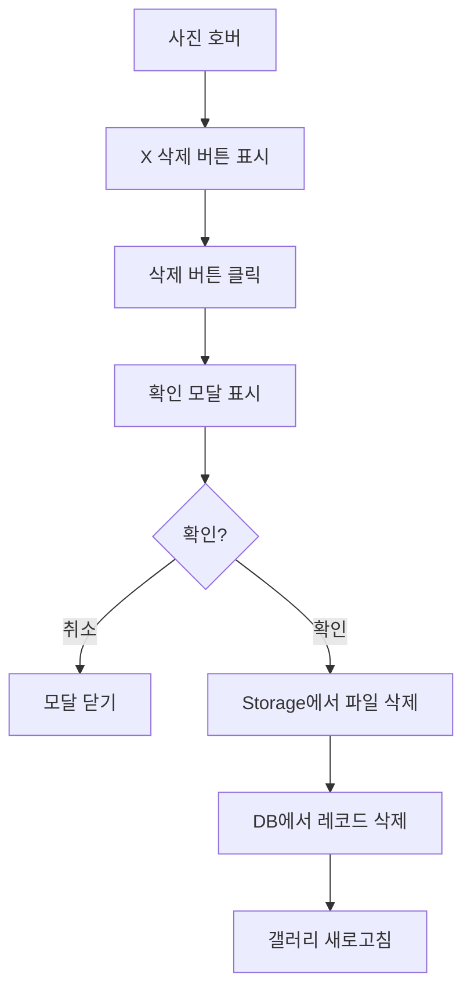

# PRD: 공간별 사진 관리 기능

**문서 버전:** v1.0  
**작성일:** 2026-04-01  
**작성자:** Buzz (AI Assistant)  
**프로젝트:** 온음 공동체 공간 예약 시스템  
**상태:** 📝 Draft

---

## 1. 개요

### 1.1 목적
사용자가 예약 전 공간(놀터/방음실)의 실제 모습을 확인할 수 있도록 공간별 사진 갤러리 기능을 제공합니다. 관리자는 설정 페이지에서 사진을 쉽게 관리(업로드/교체/삭제/순서변경)할 수 있습니다.

### 1.2 배경
- 현재 메인 페이지에 공간 사진이 없어 첫 방문자가 시설을 파악하기 어려움
- 관리자가 사진을 수정하려면 개발자 도움이 필요한 상황
- 공간별 특성(놀터 - 넓은 공용 공간, 방음실 - 음악 연습실)을 시각적으로 전달 필요

### 1.3 목표
- ✅ 사용자: 예약 전 공간 모습 확인 가능
- ✅ 관리자: 코드 수정 없이 사진 직접 관리
- ✅ 시스템: Supabase Storage 활용으로 안정적인 파일 관리

---

## 2. 기능 상세 명세

### 2.1 사용자 화면 (메인 페이지)

#### 2.1.1 갤러리 위치
```
┌─────────────────────────────────┐
│         공간 탭 (놀터/방음실)    │
├─────────────────────────────────┤
│         캘린더 영역              │
├─────────────────────────────────┤
│      📸 공간 사진 갤러리         │  ← NEW
│      (슬라이드 형태)             │
├─────────────────────────────────┤
│         이용 규칙 섹션           │
└─────────────────────────────────┘
```

#### 2.1.2 갤러리 동작
| 항목 | 상세 |
|------|------|
| **표시 조건** | 해당 공간에 사진이 1장 이상 있을 때만 표시 |
| **사진 크기** | 가로 100%, 세로 자동 (비율 유지) |
| **최대 높이** | 모바일: 200px, PC: 320px |
| **네비게이션** | 좌/우 화살표 + 하단 도트 인디케이터 |
| **자동 슬라이드** | 5초 간격 (사용자 인터랙션 시 일시 정지) |
| **터치 지원** | 좌우 스와이프로 사진 전환 |
| **사진 클릭** | 라이트박스로 전체 화면 확대 보기 |

#### 2.1.3 탭 전환 시 동작
- 놀터 탭 선택 → 놀터 사진 갤러리 표시
- 방음실 탭 선택 → 방음실 사진 갤러리 표시
- 전환 시 슬라이드 인덱스 초기화 (첫 번째 사진부터)

---

### 2.2 관리자 화면 (설정 페이지)

#### 2.2.1 UI 구조
```
┌─────────────────────────────────────────────────────┐
│  ⚙️ 설정                                            │
├─────────────────────────────────────────────────────┤
│                                                     │
│  📷 공간 사진 관리                                  │  ← NEW
│  ┌────────────────┐ ┌────────────────┐             │
│  │  🏠 놀터       │ │  🎵 방음실     │             │
│  └────────────────┘ └────────────────┘             │
│                                                     │
│  ┌─────────────────────────────────────────────┐   │
│  │ [사진1] [사진2] [사진3] [+ 추가]            │   │
│  │                                              │   │
│  │ 드래그로 순서 변경                          │   │
│  └─────────────────────────────────────────────┘   │
│                                                     │
├─────────────────────────────────────────────────────┤
│  🌐 사이트 설정 (기존)                              │
│  ...                                                │
└─────────────────────────────────────────────────────┘
```

#### 2.2.2 사진 관리 기능

| 기능 | 상세 | 우선순위 |
|------|------|----------|
| **업로드** | 파일 선택 또는 드래그&드롭 | P0 (필수) |
| **교체** | 사진 클릭 → 새 파일 선택 → 교체 | P0 (필수) |
| **삭제** | 사진 호버 시 X 버튼 표시 → 확인 후 삭제 | P0 (필수) |
| **순서 변경** | 드래그 앤 드롭으로 순서 조정 | P1 (선택) |
| **미리보기** | 업로드 전 썸네일 미리보기 | P1 (선택) |

#### 2.2.3 업로드 제약사항
| 항목 | 제한 |
|------|------|
| **허용 포맷** | JPG, JPEG, PNG, WebP |
| **최대 파일 크기** | 5MB per file |
| **최대 사진 수** | 공간당 10장 |
| **권장 비율** | 16:9 또는 4:3 |
| **최소 해상도** | 800 x 600px |

#### 2.2.4 사진 카드 UI
```
┌──────────────────────┐
│                      │
│      [썸네일]        │
│                      │
├──────────────────────┤
│ 📷 nolter_1.jpg      │
│ 1.2MB · 1920x1080    │
│ [교체] [삭제]        │
└──────────────────────┘
```

---

## 3. UI/UX 플로우

### 3.1 사용자 플로우 (메인 페이지)



### 3.2 관리자 플로우 (사진 업로드)



### 3.3 관리자 플로우 (사진 삭제)



---

## 4. 데이터베이스 스키마

### 4.1 신규 테이블: `space_photos`

```sql
-- ===== 공간 사진 테이블 =====
CREATE TABLE space_photos (
  id UUID DEFAULT gen_random_uuid() PRIMARY KEY,
  
  -- 공간 정보
  space VARCHAR(20) NOT NULL CHECK (space IN ('nolter', 'soundroom')),
  
  -- 파일 정보
  file_name VARCHAR(255) NOT NULL,           -- 원본 파일명
  storage_path VARCHAR(500) NOT NULL,        -- Supabase Storage 경로
  file_size INTEGER NOT NULL,                -- 바이트 단위
  mime_type VARCHAR(50) NOT NULL,            -- image/jpeg, image/png 등
  width INTEGER,                             -- 이미지 너비 (px)
  height INTEGER,                            -- 이미지 높이 (px)
  
  -- 정렬 & 메타
  display_order INTEGER DEFAULT 0,           -- 표시 순서 (낮을수록 먼저)
  alt_text VARCHAR(255),                     -- 접근성용 대체 텍스트
  is_active BOOLEAN DEFAULT true,            -- 활성화 여부
  
  -- 타임스탬프
  created_at TIMESTAMP WITH TIME ZONE DEFAULT NOW(),
  updated_at TIMESTAMP WITH TIME ZONE DEFAULT NOW(),
  
  -- 제약조건
  UNIQUE(storage_path)
);

-- 인덱스
CREATE INDEX idx_space_photos_space ON space_photos(space);
CREATE INDEX idx_space_photos_active_order ON space_photos(space, is_active, display_order);

-- RLS 정책
ALTER TABLE space_photos ENABLE ROW LEVEL SECURITY;

-- 모든 사용자 조회 가능 (공개 갤러리)
CREATE POLICY "Anyone can view active photos" ON space_photos
  FOR SELECT USING (is_active = true);

-- 관리자만 CUD 가능 (추후 관리자 인증 연동 시 수정)
CREATE POLICY "Admin can manage photos" ON space_photos
  FOR ALL USING (true);  -- 임시: 추후 관리자 체크 추가
```

### 4.2 Supabase Storage 버킷 설정

```sql
-- Storage 버킷 생성 (Supabase Dashboard 또는 SQL)
INSERT INTO storage.buckets (id, name, public, file_size_limit, allowed_mime_types)
VALUES (
  'space-photos',
  'space-photos',
  true,  -- 공개 접근 (이미지 URL로 직접 접근 가능)
  5242880,  -- 5MB
  ARRAY['image/jpeg', 'image/png', 'image/webp']
);

-- Storage RLS 정책
-- 읽기: 모든 사용자
CREATE POLICY "Public read access" ON storage.objects
  FOR SELECT USING (bucket_id = 'space-photos');

-- 쓰기: 인증된 사용자 (관리자)
CREATE POLICY "Admin write access" ON storage.objects
  FOR INSERT WITH CHECK (bucket_id = 'space-photos');

CREATE POLICY "Admin delete access" ON storage.objects
  FOR DELETE USING (bucket_id = 'space-photos');
```

### 4.3 Storage 파일 경로 규칙

```
space-photos/
├── nolter/
│   ├── 1_main.jpg
│   ├── 2_entrance.jpg
│   └── 3_facility.jpg
└── soundroom/
    ├── 1_room.jpg
    ├── 2_equipment.jpg
    └── 3_piano.jpg
```

**경로 패턴:** `{space}/{timestamp}_{sanitized_filename}.{ext}`

예시: `nolter/1711958400000_main_entrance.jpg`

---

## 5. API 설계

### 5.1 Server Actions

#### 5.1.1 `getSpacePhotos(space: string)`
공간별 사진 목록 조회

```typescript
// app/actions/space-photos.ts
'use server'

export async function getSpacePhotos(space: 'nolter' | 'soundroom') {
  const supabase = await createClient()
  
  const { data, error } = await supabase
    .from('space_photos')
    .select('*')
    .eq('space', space)
    .eq('is_active', true)
    .order('display_order', { ascending: true })
  
  if (error) {
    return { success: false, error: error.message }
  }
  
  // Storage URL 생성
  const photos = data.map(photo => ({
    ...photo,
    url: supabase.storage.from('space-photos').getPublicUrl(photo.storage_path).data.publicUrl
  }))
  
  return { success: true, photos }
}
```

**Response:**
```typescript
{
  success: true,
  photos: [
    {
      id: "uuid",
      space: "nolter",
      file_name: "main.jpg",
      storage_path: "nolter/1711958400000_main.jpg",
      url: "https://xxx.supabase.co/storage/v1/object/public/space-photos/nolter/...",
      file_size: 1234567,
      mime_type: "image/jpeg",
      width: 1920,
      height: 1080,
      display_order: 0,
      alt_text: "놀터 전경"
    },
    // ...
  ]
}
```

#### 5.1.2 `uploadSpacePhoto(formData: FormData)`
사진 업로드

```typescript
export async function uploadSpacePhoto(formData: FormData) {
  const supabase = await createClient()
  
  const file = formData.get('file') as File
  const space = formData.get('space') as string
  const altText = formData.get('altText') as string | null
  
  // 1. 파일 유효성 검증
  if (!file || !space) {
    return { success: false, error: '필수 데이터가 누락되었습니다.' }
  }
  
  if (file.size > 5 * 1024 * 1024) {
    return { success: false, error: '파일 크기는 5MB 이하여야 합니다.' }
  }
  
  const allowedTypes = ['image/jpeg', 'image/png', 'image/webp']
  if (!allowedTypes.includes(file.type)) {
    return { success: false, error: 'JPG, PNG, WebP 파일만 업로드 가능합니다.' }
  }
  
  // 2. 현재 사진 개수 확인
  const { count } = await supabase
    .from('space_photos')
    .select('*', { count: 'exact', head: true })
    .eq('space', space)
    .eq('is_active', true)
  
  if (count && count >= 10) {
    return { success: false, error: '공간당 최대 10장까지만 업로드 가능합니다.' }
  }
  
  // 3. Storage 업로드
  const timestamp = Date.now()
  const ext = file.name.split('.').pop()
  const sanitizedName = file.name.replace(/[^a-zA-Z0-9]/g, '_').slice(0, 50)
  const storagePath = `${space}/${timestamp}_${sanitizedName}.${ext}`
  
  const { error: uploadError } = await supabase.storage
    .from('space-photos')
    .upload(storagePath, file, {
      cacheControl: '3600',
      upsert: false
    })
  
  if (uploadError) {
    return { success: false, error: '파일 업로드 실패: ' + uploadError.message }
  }
  
  // 4. 이미지 메타데이터 추출 (클라이언트에서 전달받거나 서버에서 처리)
  // 간단 버전: width/height는 클라이언트에서 formData로 전달
  
  // 5. DB 저장
  const { data: maxOrder } = await supabase
    .from('space_photos')
    .select('display_order')
    .eq('space', space)
    .order('display_order', { ascending: false })
    .limit(1)
    .single()
  
  const newOrder = (maxOrder?.display_order ?? -1) + 1
  
  const { data, error: dbError } = await supabase
    .from('space_photos')
    .insert({
      space,
      file_name: file.name,
      storage_path: storagePath,
      file_size: file.size,
      mime_type: file.type,
      width: parseInt(formData.get('width') as string) || null,
      height: parseInt(formData.get('height') as string) || null,
      display_order: newOrder,
      alt_text: altText
    })
    .select()
    .single()
  
  if (dbError) {
    // 롤백: Storage 파일 삭제
    await supabase.storage.from('space-photos').remove([storagePath])
    return { success: false, error: 'DB 저장 실패: ' + dbError.message }
  }
  
  revalidatePath('/')
  revalidatePath('/admin/settings')
  
  return { success: true, photo: data }
}
```

#### 5.1.3 `replaceSpacePhoto(photoId: string, formData: FormData)`
사진 교체

```typescript
export async function replaceSpacePhoto(photoId: string, formData: FormData) {
  const supabase = await createClient()
  
  // 1. 기존 사진 정보 조회
  const { data: existing, error: fetchError } = await supabase
    .from('space_photos')
    .select('*')
    .eq('id', photoId)
    .single()
  
  if (fetchError || !existing) {
    return { success: false, error: '사진을 찾을 수 없습니다.' }
  }
  
  const file = formData.get('file') as File
  
  // 2. 파일 유효성 검증 (uploadSpacePhoto와 동일)
  // ... 생략 ...
  
  // 3. 새 파일 업로드
  const timestamp = Date.now()
  const ext = file.name.split('.').pop()
  const sanitizedName = file.name.replace(/[^a-zA-Z0-9]/g, '_').slice(0, 50)
  const newStoragePath = `${existing.space}/${timestamp}_${sanitizedName}.${ext}`
  
  const { error: uploadError } = await supabase.storage
    .from('space-photos')
    .upload(newStoragePath, file)
  
  if (uploadError) {
    return { success: false, error: '파일 업로드 실패' }
  }
  
  // 4. DB 업데이트
  const { error: updateError } = await supabase
    .from('space_photos')
    .update({
      file_name: file.name,
      storage_path: newStoragePath,
      file_size: file.size,
      mime_type: file.type,
      width: parseInt(formData.get('width') as string) || null,
      height: parseInt(formData.get('height') as string) || null,
      updated_at: new Date().toISOString()
    })
    .eq('id', photoId)
  
  if (updateError) {
    // 롤백
    await supabase.storage.from('space-photos').remove([newStoragePath])
    return { success: false, error: 'DB 업데이트 실패' }
  }
  
  // 5. 기존 파일 삭제
  await supabase.storage.from('space-photos').remove([existing.storage_path])
  
  revalidatePath('/')
  revalidatePath('/admin/settings')
  
  return { success: true }
}
```

#### 5.1.4 `deleteSpacePhoto(photoId: string)`
사진 삭제

```typescript
export async function deleteSpacePhoto(photoId: string) {
  const supabase = await createClient()
  
  // 1. 기존 사진 정보 조회
  const { data: existing, error: fetchError } = await supabase
    .from('space_photos')
    .select('storage_path')
    .eq('id', photoId)
    .single()
  
  if (fetchError || !existing) {
    return { success: false, error: '사진을 찾을 수 없습니다.' }
  }
  
  // 2. Storage에서 삭제
  const { error: storageError } = await supabase.storage
    .from('space-photos')
    .remove([existing.storage_path])
  
  if (storageError) {
    console.error('Storage 삭제 실패:', storageError)
    // Storage 실패해도 DB는 삭제 진행 (orphan 방지)
  }
  
  // 3. DB에서 삭제
  const { error: dbError } = await supabase
    .from('space_photos')
    .delete()
    .eq('id', photoId)
  
  if (dbError) {
    return { success: false, error: 'DB 삭제 실패: ' + dbError.message }
  }
  
  revalidatePath('/')
  revalidatePath('/admin/settings')
  
  return { success: true }
}
```

#### 5.1.5 `updatePhotoOrder(space: string, orderedIds: string[])`
사진 순서 변경

```typescript
export async function updatePhotoOrder(space: string, orderedIds: string[]) {
  const supabase = await createClient()
  
  // 트랜잭션 대신 순차 업데이트 (Supabase 제약)
  const updates = orderedIds.map((id, index) => 
    supabase
      .from('space_photos')
      .update({ display_order: index, updated_at: new Date().toISOString() })
      .eq('id', id)
      .eq('space', space)
  )
  
  const results = await Promise.all(updates)
  const hasError = results.some(r => r.error)
  
  if (hasError) {
    return { success: false, error: '순서 변경 중 오류 발생' }
  }
  
  revalidatePath('/')
  revalidatePath('/admin/settings')
  
  return { success: true }
}
```

---

## 6. 파일 구조

### 6.1 신규 파일

```
app/
├── actions/
│   └── space-photos.ts          # 📁 NEW - Server Actions
├── components/
│   └── space-gallery/           # 📁 NEW - 갤러리 컴포넌트
│       ├── SpaceGallery.tsx     # 메인 갤러리 (사용자용)
│       ├── GallerySlide.tsx     # 개별 슬라이드
│       ├── GalleryNav.tsx       # 네비게이션 (화살표, 도트)
│       └── Lightbox.tsx         # 확대 보기 모달
├── admin/
│   └── settings/
│       └── components/          # 📁 NEW - 관리자 컴포넌트
│           ├── PhotoManager.tsx # 사진 관리 메인
│           ├── PhotoCard.tsx    # 개별 사진 카드
│           ├── PhotoUploader.tsx # 업로드 컴포넌트
│           └── SortablePhotoList.tsx # 드래그 정렬 리스트
└── page.tsx                     # 수정 - 갤러리 추가
```

### 6.2 수정 파일

| 파일 | 수정 내용 |
|------|----------|
| `app/page.tsx` | SpaceGallery 컴포넌트 임포트 및 배치 |
| `app/admin/settings/page.tsx` | PhotoManager 섹션 추가 |

---

## 7. 컴포넌트 설계

### 7.1 SpaceGallery (사용자용)

```typescript
// app/components/space-gallery/SpaceGallery.tsx
'use client'

import { useState, useEffect } from 'react'
import { getSpacePhotos } from '@/app/actions/space-photos'

interface SpaceGalleryProps {
  space: 'nolter' | 'soundroom'
}

export default function SpaceGallery({ space }: SpaceGalleryProps) {
  const [photos, setPhotos] = useState<Photo[]>([])
  const [currentIndex, setCurrentIndex] = useState(0)
  const [isLightboxOpen, setIsLightboxOpen] = useState(false)
  const [isLoading, setIsLoading] = useState(true)
  
  useEffect(() => {
    loadPhotos()
  }, [space])
  
  // 자동 슬라이드 (5초)
  useEffect(() => {
    if (photos.length <= 1) return
    
    const timer = setInterval(() => {
      setCurrentIndex(prev => (prev + 1) % photos.length)
    }, 5000)
    
    return () => clearInterval(timer)
  }, [photos.length])
  
  // ... 구현 ...
  
  if (isLoading) return <GallerySkeleton />
  if (photos.length === 0) return null  // 사진 없으면 숨김
  
  return (
    <div className="relative bg-gray-100 rounded-lg overflow-hidden">
      {/* 슬라이드 영역 */}
      <div className="relative h-48 sm:h-64 md:h-80">
        {photos.map((photo, index) => (
          <GallerySlide
            key={photo.id}
            photo={photo}
            isActive={index === currentIndex}
            onClick={() => setIsLightboxOpen(true)}
          />
        ))}
      </div>
      
      {/* 네비게이션 */}
      {photos.length > 1 && (
        <GalleryNav
          total={photos.length}
          current={currentIndex}
          onPrev={() => setCurrentIndex(prev => prev === 0 ? photos.length - 1 : prev - 1)}
          onNext={() => setCurrentIndex(prev => (prev + 1) % photos.length)}
          onDotClick={setCurrentIndex}
        />
      )}
      
      {/* 라이트박스 */}
      {isLightboxOpen && (
        <Lightbox
          photos={photos}
          initialIndex={currentIndex}
          onClose={() => setIsLightboxOpen(false)}
        />
      )}
    </div>
  )
}
```

### 7.2 PhotoManager (관리자용)

```typescript
// app/admin/settings/components/PhotoManager.tsx
'use client'

import { useState, useEffect } from 'react'
import { getSpacePhotos, uploadSpacePhoto, deleteSpacePhoto, updatePhotoOrder } from '@/app/actions/space-photos'

export default function PhotoManager() {
  const [selectedSpace, setSelectedSpace] = useState<'nolter' | 'soundroom'>('nolter')
  const [photos, setPhotos] = useState<Photo[]>([])
  const [isUploading, setIsUploading] = useState(false)
  const [error, setError] = useState<string | null>(null)
  
  useEffect(() => {
    loadPhotos()
  }, [selectedSpace])
  
  const handleUpload = async (file: File) => {
    setIsUploading(true)
    setError(null)
    
    // 이미지 크기 추출
    const dimensions = await getImageDimensions(file)
    
    const formData = new FormData()
    formData.append('file', file)
    formData.append('space', selectedSpace)
    formData.append('width', dimensions.width.toString())
    formData.append('height', dimensions.height.toString())
    
    const result = await uploadSpacePhoto(formData)
    
    if (result.success) {
      loadPhotos()
    } else {
      setError(result.error || '업로드 실패')
    }
    
    setIsUploading(false)
  }
  
  // ... 삭제, 순서변경 핸들러 ...
  
  return (
    <div className="bg-white p-6 rounded-lg shadow-sm border">
      <h2 className="text-xl font-semibold mb-4">📷 공간 사진 관리</h2>
      
      {/* 공간 탭 */}
      <div className="flex gap-2 mb-4">
        <button
          onClick={() => setSelectedSpace('nolter')}
          className={`px-4 py-2 rounded-lg ${
            selectedSpace === 'nolter'
              ? 'bg-blue-500 text-white'
              : 'bg-gray-100 text-gray-700'
          }`}
        >
          🏠 놀터
        </button>
        <button
          onClick={() => setSelectedSpace('soundroom')}
          className={`px-4 py-2 rounded-lg ${
            selectedSpace === 'soundroom'
              ? 'bg-purple-500 text-white'
              : 'bg-gray-100 text-gray-700'
          }`}
        >
          🎵 방음실
        </button>
      </div>
      
      {/* 에러 메시지 */}
      {error && (
        <div className="mb-4 p-3 bg-red-50 text-red-700 rounded-lg">
          ⚠️ {error}
        </div>
      )}
      
      {/* 사진 그리드 + 업로더 */}
      <div className="grid grid-cols-2 md:grid-cols-4 gap-4">
        {photos.map((photo, index) => (
          <PhotoCard
            key={photo.id}
            photo={photo}
            onReplace={(file) => handleReplace(photo.id, file)}
            onDelete={() => handleDelete(photo.id)}
          />
        ))}
        
        {photos.length < 10 && (
          <PhotoUploader
            onUpload={handleUpload}
            isUploading={isUploading}
          />
        )}
      </div>
      
      {/* 사진 개수 안내 */}
      <p className="mt-4 text-sm text-gray-500">
        {photos.length}/10장 업로드됨
      </p>
    </div>
  )
}
```

---

## 8. 에러 처리

### 8.1 에러 시나리오

| 시나리오 | 에러 메시지 | 처리 |
|---------|------------|------|
| 파일 크기 초과 | "파일 크기는 5MB 이하여야 합니다." | 업로드 차단 |
| 잘못된 포맷 | "JPG, PNG, WebP 파일만 업로드 가능합니다." | 업로드 차단 |
| 최대 개수 초과 | "공간당 최대 10장까지만 업로드 가능합니다." | 업로드 차단 |
| Storage 업로드 실패 | "파일 업로드에 실패했습니다. 다시 시도해주세요." | 재시도 유도 |
| DB 저장 실패 | "저장에 실패했습니다. 다시 시도해주세요." | Storage 롤백 |
| 네트워크 에러 | "네트워크 오류가 발생했습니다." | 재시도 유도 |

### 8.2 로딩 상태

| 상태 | UI 표시 |
|-----|---------|
| 초기 로딩 | 스켈레톤 UI (회색 플레이스홀더) |
| 업로드 중 | 프로그레스 바 + "업로드 중..." |
| 삭제 중 | 해당 카드 반투명 + 스피너 |
| 순서 변경 중 | 전체 그리드 반투명 |

---

## 9. 보안 고려사항

### 9.1 파일 업로드 보안

| 항목 | 대응 |
|-----|------|
| **파일 타입 검증** | MIME 타입 + 확장자 이중 검증 |
| **파일 크기 제한** | 서버/클라이언트 양쪽에서 5MB 제한 |
| **파일명 처리** | 특수문자 제거, 길이 제한, 타임스탬프 prefix |
| **악성 파일** | Supabase Storage의 기본 보안 활용 |

### 9.2 권한 관리

| 작업 | 권한 |
|-----|------|
| 사진 조회 | 모든 사용자 (공개) |
| 사진 업로드/수정/삭제 | 관리자만 (admin 세션 체크) |

**현재 구현:** 관리자 페이지 접근 = 관리자로 간주  
**추후 개선:** JWT 기반 관리자 권한 체크 추가

---

## 10. 성능 최적화

### 10.1 이미지 최적화

| 기법 | 적용 |
|-----|------|
| **지연 로딩** | 뷰포트 밖 이미지 lazy loading |
| **Next.js Image** | 자동 최적화, WebP 변환, srcset |
| **캐싱** | Supabase Storage CDN + Cache-Control |
| **썸네일** | 관리자용 목록은 작은 사이즈로 표시 |

### 10.2 데이터 로딩

| 기법 | 적용 |
|-----|------|
| **초기 렌더링** | 사진 데이터 SSR or Server Component |
| **탭 전환** | 클라이언트 캐시 활용 |
| **낙관적 업데이트** | 삭제 시 즉시 UI 반영 → 실패 시 복구 |

---

## 11. 테스트 계획

### 11.1 기능 테스트

| 테스트 케이스 | 예상 결과 |
|-------------|----------|
| 사진 없는 상태에서 갤러리 | 갤러리 섹션 숨김 |
| 사진 1장일 때 갤러리 | 네비게이션 버튼 숨김 |
| 사진 여러 장일 때 갤러리 | 좌/우 화살표 + 도트 표시 |
| 탭 전환 시 사진 변경 | 해당 공간 사진으로 교체 |
| 사진 클릭 | 라이트박스 열림 |
| 5MB 초과 파일 업로드 | 에러 메시지 표시 |
| 10장 초과 업로드 시도 | 업로드 버튼 비활성화 |
| 사진 삭제 | 확인 후 목록에서 제거 |
| 드래그로 순서 변경 | 변경된 순서로 표시 |

### 11.2 반응형 테스트

| 디바이스 | 확인 사항 |
|---------|----------|
| 모바일 (375px) | 터치 스와이프 동작, 갤러리 높이 |
| 태블릿 (768px) | 2열 그리드, 적절한 여백 |
| 데스크톱 (1280px) | 4열 그리드, 큰 이미지 표시 |

---

## 12. 작업 분해 및 예상 시간

### 12.1 Phase 1: 기반 작업 (2시간)

| 작업 | 예상 시간 |
|-----|----------|
| DB 스키마 생성 (space_photos 테이블) | 15분 |
| Supabase Storage 버킷 설정 | 15분 |
| Server Actions 파일 생성 및 기본 구조 | 30분 |
| getSpacePhotos 구현 | 30분 |
| 타입 정의 | 30분 |

### 12.2 Phase 2: 사용자 갤러리 (3시간)

| 작업 | 예상 시간 |
|-----|----------|
| SpaceGallery 컴포넌트 | 1시간 |
| GallerySlide 컴포넌트 | 30분 |
| GalleryNav 컴포넌트 | 30분 |
| Lightbox 컴포넌트 | 45분 |
| 메인 페이지 통합 | 15분 |

### 12.3 Phase 3: 관리자 기능 (4시간)

| 작업 | 예상 시간 |
|-----|----------|
| uploadSpacePhoto 구현 | 45분 |
| replaceSpacePhoto 구현 | 30분 |
| deleteSpacePhoto 구현 | 30분 |
| PhotoManager 컴포넌트 | 45분 |
| PhotoCard 컴포넌트 | 30분 |
| PhotoUploader 컴포넌트 | 30분 |
| 관리자 페이지 통합 | 30분 |

### 12.4 Phase 4: 순서 변경 (선택) (2시간)

| 작업 | 예상 시간 |
|-----|----------|
| updatePhotoOrder 구현 | 30분 |
| SortablePhotoList (드래그&드롭) | 1시간 |
| 테스트 및 디버깅 | 30분 |

### 12.5 Phase 5: 테스트 & 배포 (1시간)

| 작업 | 예상 시간 |
|-----|----------|
| 기능 테스트 | 30분 |
| 반응형 테스트 | 15분 |
| Vercel 배포 확인 | 15분 |

---

## 13. 총 예상 작업 시간

| 구분 | 시간 |
|-----|------|
| **필수 기능 (P0)** | 약 10시간 |
| **선택 기능 (P1 - 순서 변경)** | 약 2시간 |
| **총합** | 약 12시간 |

---

## 14. 마일스톤

| 단계 | 산출물 | 예상 완료 |
|-----|-------|----------|
| M1 | DB/Storage 설정 완료 | Day 1 |
| M2 | 사용자 갤러리 동작 | Day 1 |
| M3 | 관리자 업로드/삭제 동작 | Day 2 |
| M4 | 순서 변경 기능 (선택) | Day 2 |
| M5 | 배포 완료 | Day 2 |

---

## 15. 참고 자료

- [Supabase Storage 문서](https://supabase.com/docs/guides/storage)
- [Next.js Image 최적화](https://nextjs.org/docs/app/building-your-application/optimizing/images)
- [dnd-kit (드래그&드롭 라이브러리)](https://dndkit.com/)

---

## 변경 이력

| 버전 | 날짜 | 작성자 | 변경 내용 |
|-----|------|-------|----------|
| v1.0 | 2026-04-01 | Buzz | 초안 작성 |
