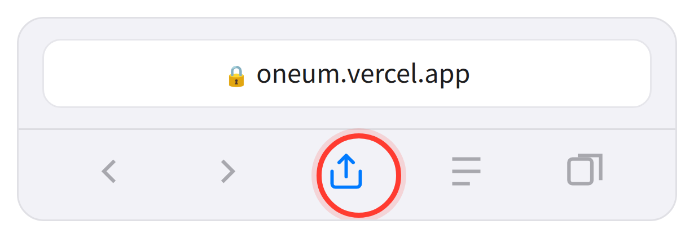
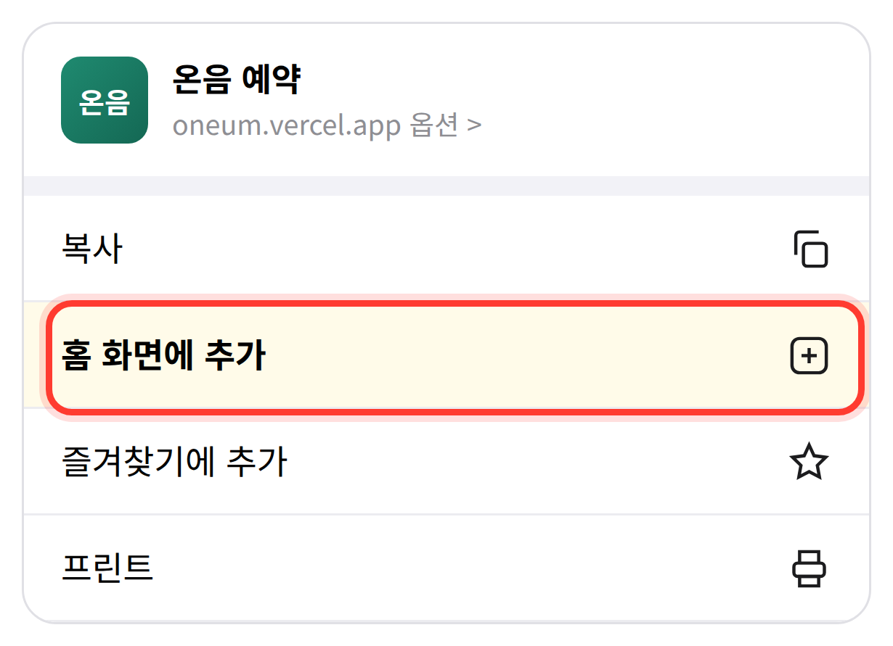
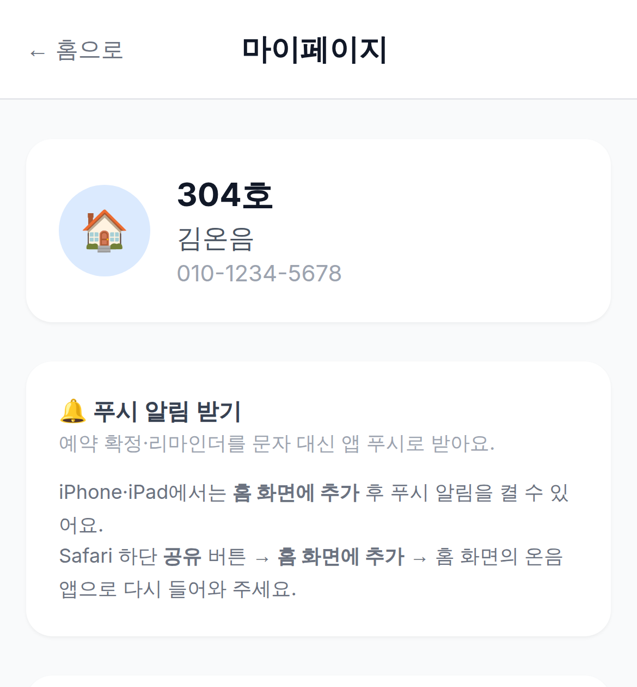
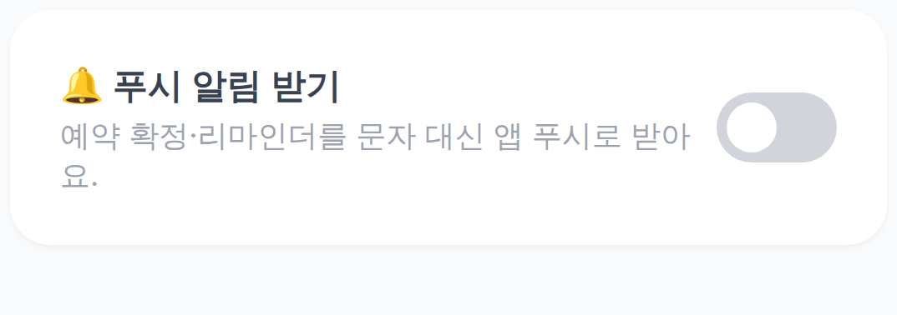
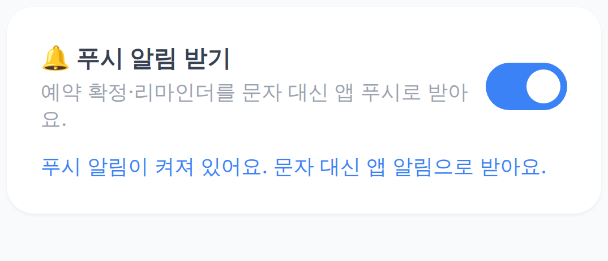
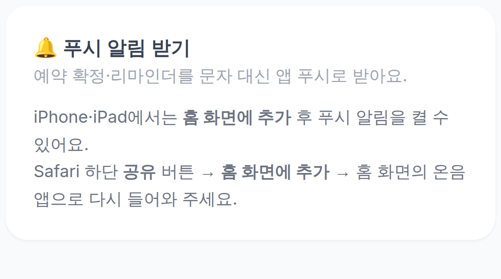
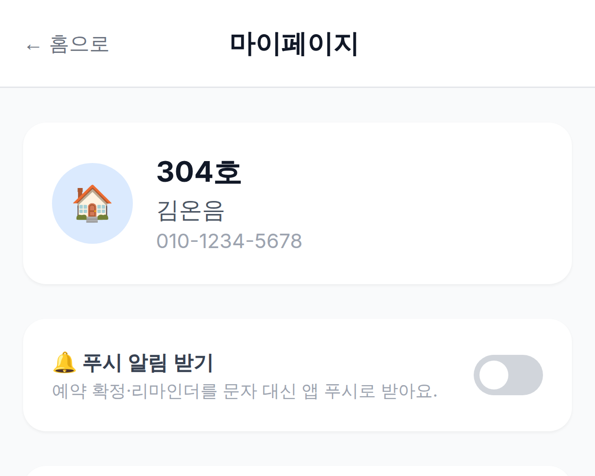
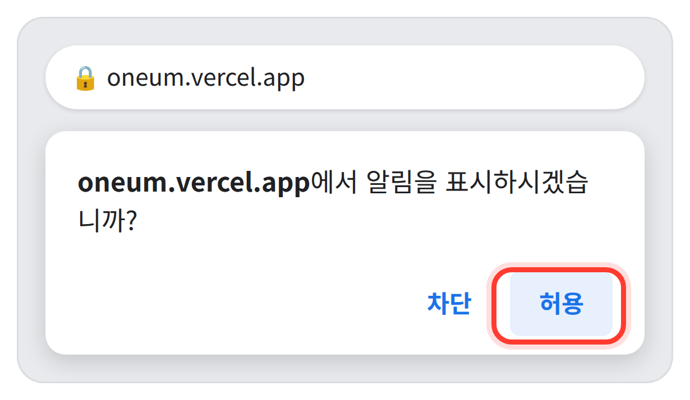

# 온음 예약 알림 — 웹푸시 설정 가이드

> [!abstract] 한 줄 요약
> 온음 예약 사이트 **마이페이지**에서 `🔔 푸시 알림 받기` 스위치를 켜면, 예약 안내를 문자 대신 휴대폰 알림으로 받습니다.
> 소요 시간 약 2분 · 비용 없음 · 아이폰은 **홈 화면에 추가**가 먼저 필요합니다.

---

## 1. 웹푸시가 뭔가요?

지금까지 예약 확정·입금 안내 같은 소식을 **문자(SMS)** 로 보내드렸습니다. 웹푸시를 켜면 같은 내용을 **카카오톡 알림처럼 휴대폰 화면에 뜨는 알림**으로 받게 됩니다. 별도 앱을 설치하거나 회원가입을 새로 할 필요 없이, 온음 예약 사이트에서 스위치 하나만 켜면 됩니다.

> [!tip] 이런 점이 좋아요
> - 알림을 누르면 **바로 내 예약 화면으로 이동**합니다.
> - 문자보다 길고 자세한 내용을 그대로 볼 수 있습니다.
> - 데이터 요금이나 별도 비용이 **전혀 들지 않습니다**.

> [!question] 푸시를 켜면 문자는 오지 않나요?
> 네. 푸시 알림이 정상적으로 전달되면 같은 내용의 문자는 발송되지 않습니다.
> 다만 휴대폰이 꺼져 있거나 알림 전달에 실패하면 **자동으로 문자가 대신 발송**되므로, 중요한 안내를 놓칠 걱정은 하지 않으셔도 됩니다.

---

## 2. 어떤 알림을 받게 되나요?

예약 과정에서 보내드리던 안내가 그대로 푸시로 전달됩니다.

| 구분 | 알림 |
| --- | --- |
| 회원 | 가입 승인 안내 |
| 예약 | 예약 완료 · 예약 완료(입금 안내) · 예약 취소 |
| 입금 | 입금 확인 · 미입금 안내 · 환불 안내 |
| 리마인더 | 이용 하루 전 안내 |
| 선불권 | 선불권 신청(입금 안내) · 선불권 활성화 완료 |
| 문의 | 문의 답변 안내 |

> [!note]
> 광고나 홍보성 알림은 보내지 않습니다. 예약·결제와 관련된 안내만 발송됩니다.

---

## 3. 시작하기 전에

- **온음 예약 사이트 계정**이 있어야 하고, 관리자 승인이 완료된 상태여야 합니다.
- 설정은 **기기마다 따로** 해야 합니다. 휴대폰에서 켜도 태블릿·PC에는 자동 적용되지 않습니다.
- 아이폰·아이패드는 **iOS 16.4 이상**이 필요합니다. (설정 → 일반 → 정보에서 확인)

> [!warning] 사용하는 기기에 맞는 쪽을 보세요
> - **아이폰 · 아이패드** → [[#4. 아이폰 · 아이패드에서 설정하기]] (홈 화면에 추가하는 과정이 **반드시** 필요합니다)
> - **안드로이드 휴대폰** → [[#5. 안드로이드에서 설정하기]] (홈 화면 추가 없이 바로 켤 수 있습니다)

---

## 4. 아이폰 · 아이패드에서 설정하기

> [!danger] 가장 중요한 두 가지
> 1. 반드시 **사파리(Safari)** 로 접속해야 합니다. 크롬·네이버·다음 앱에서는 설정할 수 없습니다.
> 2. 애플 정책상 **홈 화면에 추가한 뒤에만** 푸시 알림을 켤 수 있습니다. 3~4단계를 건너뛰면 스위치가 나타나지 않습니다.

### 1단계 — 사파리로 온음 예약 사이트에 접속합니다

주소창에 `oneum.vercel.app` 을 입력합니다. 홈 화면의 사파리 앱에서 여는 것이 확실합니다.

### 2단계 — 로그인합니다

가입하신 전화번호와 비밀번호로 로그인합니다. 로그인을 해야 어떤 회원에게 알림을 보낼지 연결됩니다.

### 3단계 — 화면 아래 **공유 버튼**을 누릅니다

사각형에서 위쪽으로 화살표가 나가는 모양의 아이콘입니다. 화면 하단 가운데(아이패드는 상단 오른쪽)에 있습니다.

*사파리 하단 바에서 빨간 동그라미 표시된 버튼 (예시 그림)*

### 4단계 — **홈 화면에 추가**를 선택합니다

메뉴를 아래로 조금 내리면 `홈 화면에 추가` 항목이 있습니다. 선택한 뒤 오른쪽 위 `추가`를 누르면 홈 화면에 온음 아이콘이 생깁니다.

*공유 메뉴를 내리면 나오는 **홈 화면에 추가** (예시 그림)*

### 5단계 — 홈 화면의 **온음 아이콘**으로 다시 들어갑니다

사파리 창이 아니라, 방금 만들어진 홈 화면 아이콘으로 실행해야 합니다. **이 점이 아이폰에서 가장 많이 놓치는 부분입니다.**

### 6단계 — 마이페이지로 이동합니다

화면 오른쪽 위의 `마이페이지` 버튼을 누릅니다. 프로필 카드 바로 아래에 푸시 알림 항목이 있습니다.

*마이페이지 상단 — 프로필 아래가 푸시 알림 항목입니다*

### 7단계 — `🔔 푸시 알림 받기` 스위치를 켭니다

오른쪽의 회색 스위치를 눌러 켜면, 알림을 허용할지 묻는 창이 뜹니다. `허용`을 선택합니다.

*누르기 전 (회색 스위치)*

### 8단계 — 완료되었는지 확인합니다

스위치가 파란색으로 바뀌고 **"푸시 알림이 켜져 있어요. 문자 대신 앱 알림으로 받아요."** 문구가 보이면 설정이 끝난 것입니다.

*설정 완료 (파란 스위치 + 안내 문구)*

> [!failure] 스위치가 보이지 않는다면
> 아래처럼 안내 문구만 보이고 스위치가 없다면, 아직 사파리 창에서 보고 계신 것입니다. 홈 화면의 온음 아이콘으로 다시 실행해 주세요.
>
> 

---

## 5. 안드로이드에서 설정하기

크롬(Chrome) 또는 삼성 인터넷에서 바로 켤 수 있습니다. 홈 화면에 추가하지 않아도 됩니다.

### 1단계 — 크롬으로 온음 예약 사이트에 접속합니다

주소창에 `oneum.vercel.app` 을 입력합니다. 삼성 인터넷을 쓰셔도 동일하게 동작합니다.

### 2단계 — 로그인합니다

가입하신 전화번호와 비밀번호로 로그인합니다.

### 3단계 — 마이페이지로 이동합니다

화면 오른쪽 위의 `마이페이지` 버튼을 누릅니다. 프로필 카드 바로 아래에 푸시 알림 항목이 있습니다.

*마이페이지 상단 — 프로필 아래가 푸시 알림 항목입니다*

### 4단계 — `🔔 푸시 알림 받기` 스위치를 켭니다

화면 위쪽에 `알림을 표시하시겠습니까?` 라는 창이 뜨면 `허용`을 누릅니다.

*크롬이 띄우는 알림 권한 요청 — **허용**을 누르세요 (예시 그림)*

### 5단계 — 완료되었는지 확인합니다

스위치가 파란색으로 바뀌고 **"푸시 알림이 켜져 있어요"** 문구가 나타나면 끝입니다.

*설정 완료 화면*

> [!tip] 앱처럼 쓰고 싶다면 (선택 사항)
> 크롬 오른쪽 위 `⋮` 메뉴 → `홈 화면에 추가` 또는 `앱 설치`를 선택하면 홈 화면에 온음 아이콘이 생겨 앱처럼 바로 열 수 있습니다. 알림 설정과는 무관하지만 훨씬 편리합니다.

---

## 6. 잘 안 될 때

| 이런 증상이라면 | 이렇게 해보세요 |
| --- | --- |
| 스위치가 아예 보이지 않음 *(아이폰)* | 홈 화면 추가가 되지 않은 상태입니다. 사파리에서 공유 → 홈 화면에 추가를 먼저 하고, **홈 화면 아이콘으로 다시 실행**해 주세요. |
| "알림 권한이 차단되어 있습니다" | 이전에 실수로 **차단**을 누른 경우입니다. **아이폰**: 설정 → 알림 → 온음 → 알림 허용 켜기 **안드로이드**: 설정 → 앱 → Chrome → 알림 → 온음 사이트 허용 (또는 크롬 주소창 왼쪽 자물쇠 → 사이트 설정 → 알림 → 허용) |
| "현재 브라우저는 푸시 알림을 지원하지 않습니다" | 카카오톡·인스타그램 등 앱 안에서 링크를 눌러 열었을 때 나타납니다. 주소를 복사해 **사파리나 크롬에서 직접** 열어주세요. |
| 스위치는 켰는데 알림이 오지 않음 | 기기의 **방해금지 모드·집중 모드**가 켜져 있는지, 절전 모드로 백그라운드 활동이 제한되어 있는지 확인해 주세요. 알림이 실패하면 문자로 자동 발송됩니다. |
| 휴대폰에서는 오는데 태블릿에는 안 옴 | 알림 설정은 기기·브라우저별로 저장됩니다. 받고 싶은 기기마다 같은 방법으로 한 번씩 켜주세요. |
| 홈 화면 아이콘을 지웠음 *(아이폰)* | 알림 설정도 함께 해제됩니다. 처음부터 다시 홈 화면에 추가한 뒤 스위치를 켜주세요. |

---

## 7. 자주 묻는 질문

> [!question]- 푸시 알림을 켜면 문자는 완전히 안 오나요?
> 푸시가 정상 전달되면 같은 내용의 문자는 보내지 않습니다. 전달에 실패한 경우에만 문자로 자동 발송되므로 안내를 놓치지 않습니다.

> [!question]- 앱을 따로 설치해야 하나요?
> 아니요. 앱스토어·플레이스토어에서 내려받을 앱은 없습니다. 웹사이트를 홈 화면에 바로가기로 추가하는 것뿐이라 저장 공간도 거의 쓰지 않습니다.

> [!question]- 비용이나 데이터 요금이 드나요?
> 전혀 들지 않습니다. 무료로 이용하실 수 있습니다.

> [!question]- 알림을 다시 끄고 싶어요.
> 마이페이지의 `🔔 푸시 알림 받기` 스위치를 다시 눌러 끄면 됩니다. 그 이후에는 예전처럼 문자로 안내를 받게 됩니다.

> [!question]- 가족이 함께 쓰는데, 한 기기에서 여러 명이 받을 수 있나요?
> 알림은 마지막으로 스위치를 켠 계정 기준으로 전달됩니다. 각자 본인 휴대폰에서 본인 계정으로 로그인해 설정하시는 것을 권합니다.

> [!question]- 알림을 누르면 어디로 가나요?
> 예약 관련 알림은 마이페이지의 예약 목록으로, 선불권 관련 알림은 선불권 화면으로 바로 이동합니다.

> [!question]- 기존에 등록한 전화번호를 바꾸면 어떻게 되나요?
> 푸시 알림은 전화번호가 아니라 로그인한 계정과 기기에 연결됩니다. 번호를 변경해도 푸시는 그대로 오지만, 문자 발송을 위해 관리자에게 변경된 번호를 알려주세요.

---

## 8. 설정 완료 체크리스트

- [ ] 온음 예약 사이트에 **로그인**했다
- [ ] (아이폰만) **사파리**로 접속해 **홈 화면에 추가**했다
- [ ] (아이폰만) **홈 화면 아이콘**으로 다시 실행했다
- [ ] **마이페이지**에 들어갔다
- [ ] `🔔 푸시 알림 받기` 스위치를 켜고 **허용**을 눌렀다
- [ ] 스위치가 **파란색**으로 바뀌고 안내 문구가 보인다

---

> [!info] 문의
> 설정이 잘 되지 않으면 온음 관리자에게 문의해 주세요.
> 온음 커뮤니티 공간 예약 시스템 · https://oneum.vercel.app
